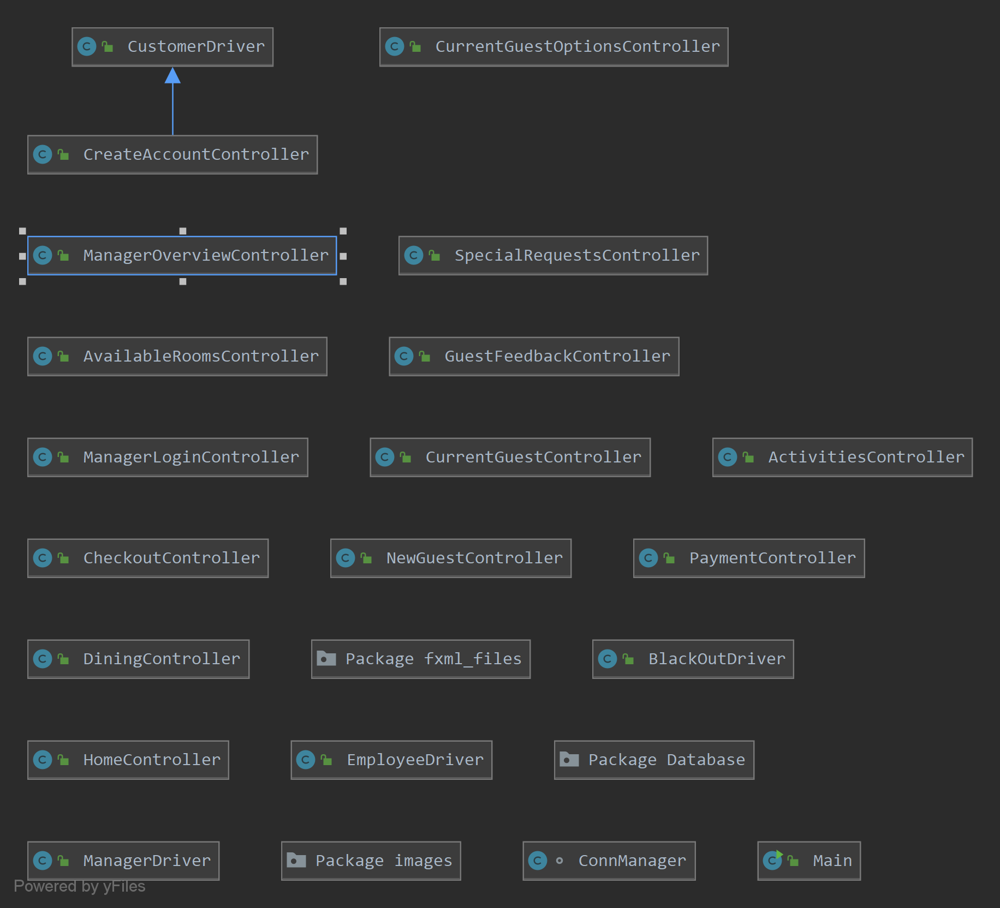

# Sandy Shores Resort
CEN 3031 Resort Project

## Installation

- On the [home page](https://github.com/Acavallaro75/SandyShoresResort) of the Sandy Shores resort, select the clone or download drop-down menu and copy the URL displayed in that menu. Alternatively, the link is here for your convenience: https://github.com/Acavallaro75/SandyShoresResort.git.

- Once the link has been copied, open your Java IDE, preferably IntilliJ IDEA Ultimate Edition by JetBrains as that was what was used to produce the project, and select "Get from Version Control".

- Paste the copied URL into the field URL and choose where you would like to save this project and select clone.

- You will be prompted with a message asking if you would like to open the project. Select yes to view the project.

## Running the Program

- A runnable jar has been made, so you should only need to go to the Main class in the resort package and press run to access the program.

- On the left side of the Main class select the green triangle and select "Run 'Main.main()'" and the program should run.

- The database also has been implemented with a jar file, so that should aslo work with no problems.

## Documentation

- The following link will contain all of the [JavaDoc]() for the project.

## Diagrams

##### Class Diagram:

- Edited by: Andrew Cavallaro on 10/20/2019
- Edited by: Joseph Cisar on 11/30/2019
